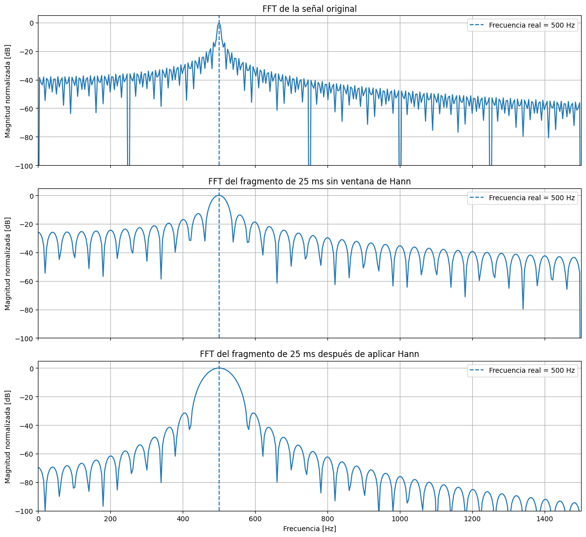
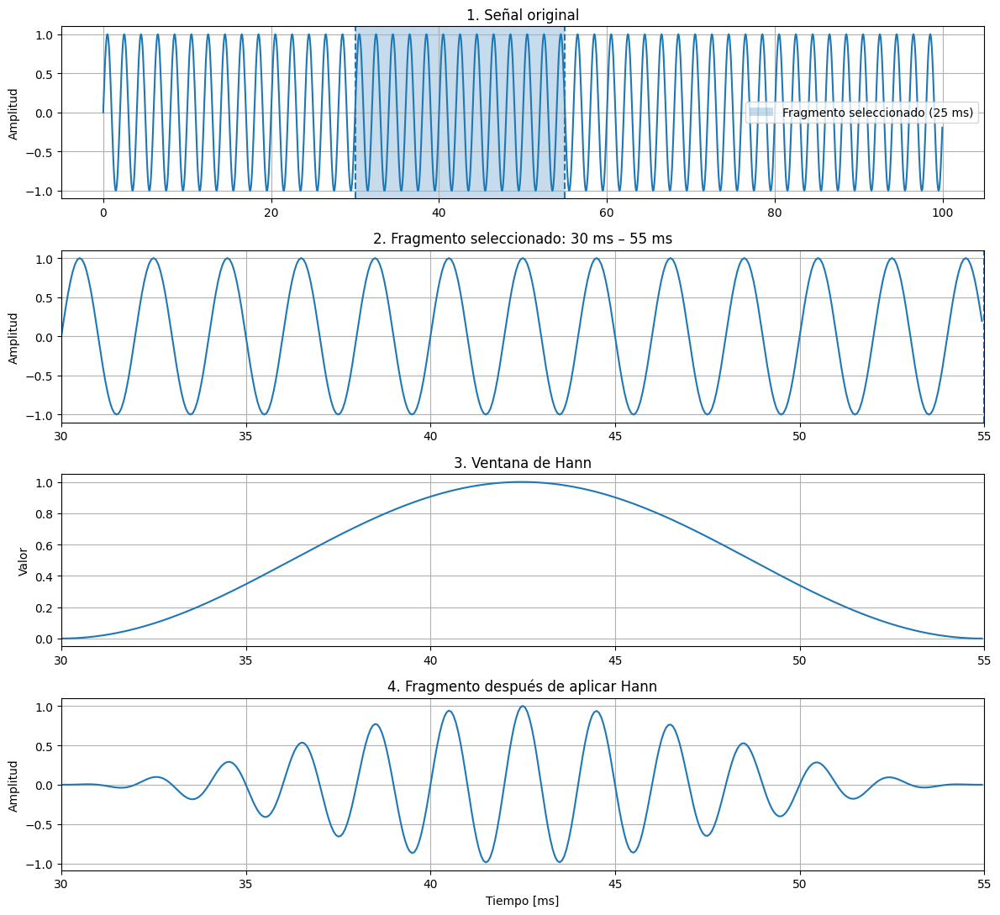

# TinyML Keywords

Workshop de clasificación de palabras mediante TinyML


## Hardware requerido

Para implementar el sistema de reconocimiento de palabras con TinyML se requiere algunos componentes de hardware. El objetivo es adquirir la señal de voz, procesarla localmente y ejecutar la inferencia directamente en el microcontrolador.

### Componentes principales

- **ESP32-S3 N16R8**
- **Módulo de micrófono MAX9814**
- Protoboard
- Cables de conexión
- Cable USB para programación y alimentación

### ¿Qué es una señal?

Una **señal** es una representación de cómo cambia una magnitud física con respecto a otra variable, generalmente el tiempo. En el caso del sonido, las variaciones de presión del aire producidas por una fuente sonora, como la voz humana, pueden ser convertidas por un micrófono (**MAX9814**) en una señal eléctrica.

Matemáticamente, una señal continua puede representarse como:

$$
x(t)
$$

donde:

- $x$ representa la amplitud de la señal.
- $t$ representa el tiempo.

Cuando una persona pronuncia una palabra como **"murciélago"** o **"plátano"**, la presión acústica cambia continuamente, generando una forma de onda particular. En este sistema, el micrófono convierte las variaciones acústicas producidas por la voz en una señal eléctrica, la cual será adquirida por el convertidor analógico-digital del **ESP32-S3**.


### Señales analógicas y digitales

Una señal puede representarse de forma **analógica** o **digital**. Una señal analógica presenta variaciones continuas en el tiempo y en amplitud:

$$
x(t)
$$

Sin embargo, los microcontroladores trabajan con valores numéricos discretos. Por esta razón, la señal debe convertirse en una secuencia digital:

$$
x[n]
$$
donde $n$ representa el índice de cada muestra.

El proceso puede representarse como:

```text
Voz
 ↓
Variaciones de presión acústica
 ↓
Micrófono
 ↓
Señal eléctrica analógica
 ↓
ADC
 ↓
Secuencia digital de muestras
```

El **ADC del ESP32-S3** se configura con una resolución de **12 bits**. Por tanto, cada muestra puede representarse aproximadamente mediante valores comprendidos entre:

$$
0 \leq x[n] \leq 4095
$$

Antes de realizar el análisis espectral, se elimina el valor medio de la señal para reducir su componente de continua.


###  Muestreo

El **muestreo** consiste en medir el valor de una señal analógica en instantes regulares de tiempo.

Una señal continua:

$$
x(t)
$$

puede convertirse en una secuencia discreta mediante:

$$
x[n] = x(nT_s)
$$

donde:

- $n$ representa el índice de la muestra.
- $T_s$ representa el periodo de muestreo.

La frecuencia de muestreo se define como:

$$
f_s = \frac{1}{T_s}
$$

y representa el número de muestras adquiridas cada segundo.

En este proyecto se utiliza:

$$
f_s = 16000\ Hz
$$

lo que significa que se adquieren **16.000 muestras por segundo**.


#### Teorema de Nyquist

Para representar adecuadamente una señal, la frecuencia de muestreo debe ser al menos el doble de la frecuencia máxima que se desea analizar:

$$
f_s \geq 2f_{max}
$$

La frecuencia máxima que puede representarse sin ambigüedad se denomina **frecuencia de Nyquist**:

$$
f_N = \frac{f_s}{2}
$$

Para una frecuencia de muestreo de 16 kHz:

$$
f_N = \frac{16000}{2} = 8000\ Hz
$$

Por tanto, pueden representarse teóricamente componentes frecuenciales hasta aproximadamente **8 kHz**.

En este proyecto se utiliza principalmente el intervalo:

$$
80\ Hz \leq f \leq 3000\ Hz
$$

#### Duración del audio

Cada captura tiene una duración de:

$$
T = 1.2\ s
$$

El número total de muestras se obtiene mediante:

$$
N = f_sT
$$

Por tanto:

$$
N = 16000 \times 1.2 = 19200
$$

Cada registro tiene **19.200 muestras de audio**.

### Señales estacionarias y no estacionarias

Una señal se considera aproximadamente **estacionaria** cuando sus propiedades estadísticas o espectrales permanecen constantes durante el intervalo analizado.

La voz humana es una señal **no estacionaria**, debido a que su contenido frecuencial cambia continuamente durante la pronunciación.
Cada segmento presenta diferentes combinaciones de vocales, consonantes y transiciones acústicas. Por esta razón, para reconocer una palabra no es suficiente conocer únicamente qué frecuencias aparecen durante toda la grabación.

También resulta importante conocer: **cómo cambian las frecuencias a lo largo del tiempo.**

Esta característica de la voz requiere el uso de representaciones **tiempo-frecuencia**.


### Transformada de Fourier

La Transformada de Fourier permite representar una señal en términos de componentes sinusoidales de diferentes frecuencias. La idea fundamental es que una señal compleja puede describirse como una combinación de senos y cosenos, o de forma equivalente, mediante exponenciales complejas.

Conceptualmente:

```text
Señal en el tiempo
       ↓
Transformada de Fourier
       ↓
Componentes frecuenciales

#### Resolución frecuencial
```

Para una señal continua, la Transformada de Fourier se expresa como:

$$
X(f)=
\int_{-\infty}^{\infty}
x(t)e^{-j2\pi ft}\,dt
$$

donde:

- $x(t)$ representa la señal en el dominio del tiempo.
- $X(f)$ representa la señal en el dominio de la frecuencia.
- $f$ representa la frecuencia.
- $j$ representa la unidad imaginaria.

El resultado de la Transformada de Fourier permite determinar **qué frecuencias están presentes en una señal y con qué amplitud y fase contribuye cada una de ellas**.

Por ejemplo, si una señal contiene principalmente componentes de 200 Hz y 800 Hz, su representación en frecuencia mostrará una mayor contribución alrededor de esas frecuencias.

En una señal de voz, este análisis permite estudiar cómo se distribuye la energía entre diferentes componentes frecuenciales.

En términos simples:

> **La Transformada de Fourier permite pasar de observar cómo cambia una señal en el tiempo a analizar las frecuencias que la componen.**


### 3.6 Transformada Discreta de Fourier (DFT)

Los computadores y **microcontroladores** no procesan directamente señales continuas. Trabajan con secuencias de valores obtenidos mediante el proceso de muestreo. Por esta razón se utiliza la **Transformada Discreta de Fourier (DFT)**. Mientras que la Transformada de Fourier describe matemáticamente una señal continua en el dominio frecuencial, la DFT permite realizar este análisis sobre una cantidad finita de muestras digitales. Una señal digital formada por $N$ muestras puede representarse como:

$$
x[0],x[1],x[2],...,x[N-1]
$$

La DFT se define mediante:

$$
X[k] = \sum_{n=0}^{N-1} x[n]e^{-j2\pi kn/N}
$$

donde:

- $n$ representa el índice de la muestra en el dominio temporal.
- $k$ representa el índice en el dominio frecuencial.
- $N$ representa el número total de muestras analizadas.
- $X[k]$ representa la contribución de la componente frecuencial asociada al índice $k$.
- $X[k]$ representa la contribución de la componente frecuencial asociada al índice $k$.

Conceptualmente:

```text
Señal digital
x[0], x[1], ..., x[N-1]
          ↓
         DFT
          ↓
Componentes frecuenciales
X[0], X[1], ..., X[N-1]
```

Cada índice $k$ se relaciona con una frecuencia mediante:

$$
f_k=
\frac{k f_s}{N}
$$

donde:

- $f_k$ corresponde a la frecuencia asociada al bin $k$.
- $f_s$ corresponde a la frecuencia de muestreo.
- $N$ corresponde al número de puntos utilizados en la transformación.

Por tanto, la DFT puede interpretarse como una forma de determinar **cuánto contribuye cada una de un conjunto de frecuencias conocidas a la señal original**.

La magnitud de cada coeficiente:

$$
|X[k]|
$$

proporciona información sobre la intensidad de esa componente frecuencial, mientras que el ángulo:

$$
\angle X[k]
$$

contiene información sobre su fase.

En términos simples: **La DFT lleva la idea de la Transformada de Fourier al procesamiento de señales digitales formadas por un número finito de muestras.**

### Transformada Rápida de Fourier (FFT)

La **Transformada Rápida de Fourier (FFT)** no es una transformada diferente de la DFT. La FFT es un conjunto de algoritmos que permite **calcular la DFT de manera mucho más eficiente**.  FFT es especialmente importante cuando se procesan grandes cantidades de datos o cuando los cálculos deben realizarse en dispositivos con recursos limitados, como un microcontrolador.

### Limitaciones de Fourier

Aplicar una única Transformada de Fourier a toda una grabación permite determinar las frecuencias presentes en el audio completo. Sin embargo, existe una limitación fundamental:
> **FFT global no permite determinar directamente en qué momento aparece cada componente frecuencial.**


### Transformada de Fourier de Tiempo Corto

La **Transformada de Fourier de Tiempo Corto**, permite analizar cómo cambia las frecuencias presentes en una señal a medida que transcurre el tiempo. La señal se divide en pequeñas ventanas temporales y se calcula una FFT para cada una.

```text
Audio completo
│
├── Ventana 1 → FFT
├── Ventana 2 → FFT
├── Ventana 3 → FFT
├── Ventana 4 → FFT
│
└── ...
        ↓
Representación tiempo-frecuencia
```

Una expresión general de la STFT puede escribirse como:

$$
X(m,k) =
\sum_n
x[n]w[n-mH]e^{-j2\pi kn/N}
$$

donde:

- $x[n]$ representa la señal.
- $w[n]$ representa la función de ventana.
- $m$ representa la posición temporal.
- $H$ representa el desplazamiento entre ventanas.
- $k$ representa el índice frecuencial.
- $N$ representa el tamaño de la FFT.

#### Parámetros utilizados en este proyecto

| Parámetro | Valor |
|---|---:|
| Frecuencia de muestreo | 16 kHz |
| Duración del audio | 1.2 s |
| Número de muestras | 19.200 |
| Longitud de ventana | 25 ms |
| Muestras por ventana | 400 |
| Desplazamiento (*hop*) | 5 ms |
| Muestras por desplazamiento | 80 |
| Tamaño FFT | 512 |
| Frecuencia mínima | 80 Hz |
| Frecuencia máxima | 3000 Hz |

Una ventana de 25 ms contiene:

$$
0.025\times16000=400
$$

muestras.

El desplazamiento de 5 ms corresponde a:

$$
0.005\times16000=80
$$

muestras.

Como el desplazamiento es menor que la longitud de la ventana, las ventanas se superponen.

#### Número de ventanas

El número de ventanas se calcula mediante:

$$
N_w=
1+
\left\lfloor
\frac{N-L}{H}
\right\rfloor
$$

donde:

- $N=19200$
- $L=400$
- $H=80$

Por tanto:

$$
N_w=
1+
\left\lfloor
\frac{19200-400}{80}
\right\rfloor
=
236
$$

Cada grabación produce entonces **236 ventanas temporales**.


### Fuga espectral y ventana de Hann

Normalmente no se dispone de una señal infinita, sino de un **fragmento de duración limitada**. En este proyecto, por ejemplo, el audio se divide en segmentos de **25 ms** para analizar cómo cambia su contenido frecuencial a lo largo del tiempo. Al realizar este recorte, el fragmento puede comenzar y terminar en cualquier punto de las oscilaciones presentes en la señal. Por tanto, sus extremos no necesariamente coinciden de forma natural.

Por ejemplo, para una señal de 500 Hz analizada durante 25 ms:

$$
500 \times 0.025 = 12.5
$$

Dentro del fragmento aparecen **12.5 ciclos**. Esto significa que el segmento termina a mitad de un ciclo.

La FFT analiza ese fragmento finito y, como consecuencia del corte, la energía asociada originalmente con una frecuencia puede aparecer distribuida hacia frecuencias cercanas. Este fenómeno se denomina **fuga espectral** (*spectral leakage*).

Es decir, **La fuga espectral ocurre cuando la energía de una componente frecuencial aparece distribuida artificialmente hacia otras frecuencias debido al análisis de un fragmento finito de la señal.**

Por ejemplo, aunque una señal contenga únicamente una frecuencia de 500 Hz, su FFT puede mostrar energía alrededor de 400 Hz, 450 Hz, 550 Hz, 600 Hz y otras frecuencias. Esta energía adicional no implica necesariamente que estas frecuencias estuvieran presentes originalmente en la señal. Parte de ella aparece como consecuencia del recorte utilizado para realizar el análisis.




### ¿Cómo ayuda la ventana de Hann?

Para reducir los efectos producidos por los cortes se utiliza una **función de ventana**. En este proyecto se emplea la **ventana de Hann**, definida como:

$$
w[n] = 0.5 - 0.5\cos\left(\frac{2\pi n}{N-1}\right)
$$

La ventana se multiplica punto a punto por el fragmento de señal:

$$
x_{Hann}[n] = x[n]w[n]
$$

La ventana de Hann tiene valores próximos a cero en los extremos y cercanos a uno en la zona central. Por tanto, transforma un segmento con extremos abruptos en otro cuyos extremos disminuyen progresivamente:



#### Zero padding y relación con FFT

El **zero padding** consiste en agregar ceros al final de una señal antes de calcular la FFT. Esta operación no modifica la información original de la señal, sino que permite completar el número de puntos requerido para realizar la transformada.

En este proyecto, cada fragmento de audio tiene una duración de **25 ms** y se muestrea a **16 kHz**, por lo que contiene:

$$
N = 16000 \times 0.025 = 400
$$

muestras.

Para calcular una FFT de **512 puntos**, se agregan:

$$
512 - 400 = 112
$$

ceros al final del fragmento.

```text
400 muestras reales + 112 ceros = 512 puntos
```


#### ¿Por qué utilizar 512 puntos?

Se seleccionan 512 puntos porque:

$$
512 = 2^9
$$

Las potencias de 2 permiten implementar algoritmos FFT de forma particularmente eficiente, ya que el cálculo puede dividirse repetidamente en problemas más pequeños. Aunque actualmente existen algoritmos FFT capaces de trabajar con tamaños que no son potencias de 2, utilizar valores como 256, 512, 1024 o 2048 sigue siendo una práctica común, especialmente en sistemas embebidos donde la eficiencia computacional es importante.

En este caso:

$$
256 < 400 < 512
$$

por lo que **512 es la siguiente potencia de 2 capaz de contener las 400 muestras del fragmento**.

---

#### Espaciamiento entre los puntos del espectro

El número de puntos utilizado en la FFT determina el espaciamiento entre los valores calculados en el eje de frecuencia:

$$
\Delta f = \frac{f_s}{N_{FFT}}
$$

Si se utilizara una FFT de 400 puntos:

$$
\Delta f = \frac{16000}{400} = 40\ Hz
$$

por lo que los puntos del espectro estarían ubicados en:

```text
0 Hz
40 Hz
80 Hz
120 Hz
160 Hz
...
```

Al utilizar una FFT de 512 puntos:

$$
\Delta f = \frac{16000}{512} = 31.25\ Hz
$$

los puntos aparecen en:

```text
0 Hz
31.25 Hz
62.5 Hz
93.75 Hz
125 Hz
156.25 Hz
...
```

Por esta razón se dice que el zero padding produce una **representación más densa del espectro**: la FFT calcula valores en frecuencias más cercanas entre sí, permitiendo observar con mayor detalle la forma del espectro.

#### ¿El zero padding aumenta la resolución frecuencial?

No necesariamente. Aunque al pasar de 400 a 512 puntos el espaciamiento entre los bins disminuye de:

$$
40\ Hz
$$

a:

$$
31.25\ Hz
$$

la señal original sigue conteniendo únicamente **25 ms de información real**. Esto permite utilizar una FFT eficiente y obtener valores del espectro en frecuencias más cercanas entre sí. Sin embargo, no agrega nueva información a la señal, no mejora por sí solo la resolución en frecuencia rea. 


